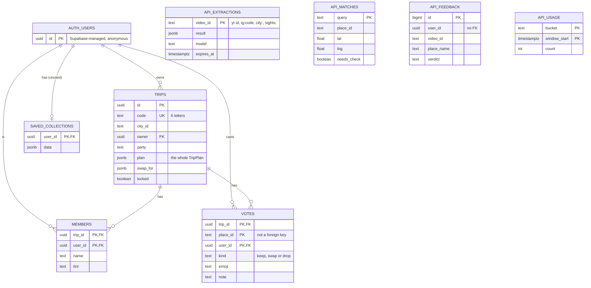

# Database and data storage

Traced from `supabase/schema.sql`, `supabase/api.sql`, `src/server/store.ts`, `src/server/limits.ts`,
`src/lib/live/*` and `src/state/trips.tsx` at `939a6bb`.

## In plain words

Xplore keeps data in **two places**:

1. **On your phone or browser** ("device storage"). This holds everything that's *yours*: saved
   places, collections, plans, your name and photo, your home district, what you've been to. There's
   no account, so this is the only copy.
2. **In Supabase**, a hosted Postgres database. It holds two kinds of thing:
   - **Shared caches and counters**, used only by our server, so a video read once is reused by
     everyone and nobody goes over the free limits.
   - **Shared group trips**, used directly by the app, so friends can vote on the same plan live.

The database is set up by hand: someone pastes the two `.sql` files into Supabase's SQL editor.
There are no migration tools in the repo.

---

## Relationship diagram

The `api_*` tables have **no relationships**: each one stands alone, keyed by text.
`api_feedback.user_id` is not a foreign key. `votes.place_id` points at a place ID inside the
`plan` JSON, not at a table.

---

## Tables used by the SERVER (secret key, bypasses row rules)

Row Level Security is **on with no policies** for these four, so the app's public key can't read or
write them (the comment at the top of `supabase/api.sql`).

### `api_extractions`: a video's places, and other things "read from outside and kept 30 days"

| | |
|---|---|
| Columns | `video_id text PK`, `result jsonb`, `model text`, `created_at`, `expires_at` (default now + 30 days) |
| Index | `api_extractions_expires (expires_at)` |
| Keys used | `<11-char YouTube id>`; `ig:<shortcode>`; `city:<name-state>` (city notes); `sights:<region>` (best-known spots) |
| Creates / updates | `putKept()` in `src/server/store.ts` (upsert), via `putExtraction`, `putCityNotes`, `putSights` |
| Reads | `getKept()`: `select result where video_id = key and expires_at > now()` |
| Deletes | `api_consume(..., p_cleanup = true)` deletes expired rows. It runs on each `allowExtract` (each new link or best-known-spots request). |
| Why 30 days | The comment cites YouTube's developer policies on keeping API data |

### `api_matches`: what a place name resolved to on Google

| | |
|---|---|
| Columns | `query text PK`, `place_id text` (null = Google had no match), `lat`, `lng`, `location_fetched_at`, `needs_check bool`, `updated_at` |
| Index | `api_matches_location_age (location_fetched_at)` |
| Key | Lower-case `"name, area, region"`, or `id:<placeId>` when the place was picked from search |
| Creates / updates | `putMatch()` in `src/server/store.ts` (upsert) |
| Reads | `api_match_begin()` (database function, called by `beginMatch()` in `src/server/limits.ts`) |
| Deletes | Never deletes rows. Cleanup **nulls** `lat`/`lng` older than 30 days. A miss is treated as stale after 7 days. |
| Why | The comment cites Google Maps Platform terms 14.3: place IDs may be kept indefinitely, coordinates up to 30 days |

### `api_feedback`: Right / Wrong / added answers from the review screen

| | |
|---|---|
| Columns | `id bigint PK (identity)`, `user_id uuid`, `video_id`, `place_name` (1–200 chars), `place_id`, `verdict` (`right \| wrong \| added`), `created_at` |
| Creates | `addFeedback()` in `src/server/store.ts`, from `POST /api/feedback` |
| Reads / updates / deletes | **No code does.** Read by hand in the Supabase dashboard (UNKNOWN beyond that). |

### `api_usage`: rate-limit and daily-cap counters

| | |
|---|---|
| Columns | `bucket text`, `window_start timestamptz`, `count int`; PK `(bucket, window_start)` |
| Bucket names | `user:<uuid>:extract`, `ip:<address>:extract`, `global:extract`, `user:…:match`, `ip:…:match`, `global:place-details`, `global:photos`, `…:search`, `…:place-info`, `…:city-notes`, `user:…:feedback`, `global:instagram-reel`, `global:instagram-transcript` |
| Creates / updates | `api_count()` (inside `api_consume` and `api_match_begin`): insert, or `count + 1` for the current window |
| Reads | The same functions return the first bucket over its limit |
| Deletes | Cleanup deletes windows older than 3 days |

### Database functions (server-only; `service_role` may execute them)

| Function | What it does |
|---|---|
| `api_count(buckets[], seconds[], limits[])` | Counts one use in each bucket's current window; returns the first bucket over its limit |
| `api_consume(..., p_cleanup)` | `api_count`, plus (when asked) the 30-day / 3-day cleanup |
| `api_match_begin(query, user bucket/limit, ip bucket/limit, details limit, want photo, photo limit)` | One round trip for a match: rate limits, the stored match and whether it's fresh, and whether today's Place Details and photo caps allow a lookup |

---

## Tables used by the APP directly (publishable key + the user's token, row rules apply)

Defined in `supabase/schema.sql`. All three are in the `supabase_realtime` publication, so changes
are pushed to listening phones.

### `trips`: a shared group trip

| | |
|---|---|
| Columns | `id uuid PK`, `code text UNIQUE` (6 letters from `ABCDEFGHJKLMNPQRSTUVWXYZ23456789`), `city_id`, `owner uuid FK auth.users` (cascade delete), `party`, `plan jsonb` (the whole plan, in the "wire" format from `src/lib/live/wire.ts`), `swap_for jsonb`, `locked bool`, `created_at`, `updated_at` |
| Creates | `create_trip()` database function (security definer), called by `createTrip()` in `src/lib/live/api.ts` from `share()` in `src/app/share/[id].tsx` |
| Reads | `loadTrip()`; realtime `UPDATE` events in `watchTrip()` |
| Updates | `savePlan()` (plan, locked), from `usePlanWriter()` in `src/state/live.tsx`. Trigger `guard_lock` refuses a lock change by anyone but the owner and sets `updated_at`. Column grants allow only `plan` and `locked` to be updated. |
| Deletes | **No code deletes a trip.** Only a cascade if the owner's auth user is deleted. |
| Row rules | Select and update only if `is_member(id)` |

### `members`: who is on a trip

| | |
|---|---|
| Columns | PK `(trip_id, user_id)`, `name` (1–40 chars), `tint`, `joined_at` |
| Creates | `create_trip()` (the owner) and `join_trip(code, name, tint)` (anyone with the code). Joining again updates the name. |
| Reads | `loadTrip()`; realtime `INSERT` |
| Updates / deletes | Only via `join_trip`'s name update. **No leave-trip code.** |
| Row rules | Select only if a member. No insert, update or delete policy (the security-definer functions do the inserts). |

### `votes`: one vote per person per stop

| | |
|---|---|
| Columns | PK `(trip_id, place_id, user_id)`, `kind` (`keep \| swap \| drop`), `emoji`, `note` (≤140 chars), `updated_at` |
| Creates / updates | `castVote()`: an upsert from `useLiveVote().cast()` on `src/app/vote/[id].tsx` |
| Reads | `loadTrip()`; realtime (all events; deletes ignored) |
| Deletes | No code |
| Row rules | Select if a member; insert and update only your own row (`user_id = auth.uid()`) and only if a member |

### `saved_collections`: one row of saved places per person

Defined in `supabase/api.sql` with an "own row only" rule. **No code in `src/` reads or writes it**
(a search for `saved_collections` finds only the SQL). Saved places live on the device instead.

### `auth.users`: managed by Supabase

A row is made by `supabase.auth.signInAnonymously()` in `ensureUser()` (`src/lib/live/client.ts`) the
first time the app needs the network (reading a link, sharing, joining). No email, no password.

---

## The entities you asked about, and where each one actually lives

| Entity | Where it lives | Created by | Updated by | Read by | Deleted by |
|---|---|---|---|---|---|
| User | Supabase `auth.users` (anonymous) + the session in device storage | `ensureUser()` | Supabase token refresh (`autoRefreshToken: true`) | `authHeader()`, `caller()` on the server | Nothing in the code |
| Video record | DATABASE `api_extractions` (shared, 30 days) + phone `xplore.link.v2.<key>` (30 days) + the reel inside the trips copy | `extract()` / `extractReel()`; `cache.write()` | Upsert on a re-read after expiry | `getExtraction()`; `cache.read()` | Cleanup after 30 days; the phone copy is ignored after 30 days |
| Extracted places | Inside `api_extractions.result`; matches in `api_matches`; the app's places in the `live` registry + trips copy | `findPlaces()`, `match()`, `toPlaces()` | `refreshPlace()` / `betterPhoto()` (coordinates, photo) | Every screen via `getPlace()` in `src/data/api.ts` | Coordinates nulled after 30 days on the server |
| Destination (city) | Sample cities: `src/data/catalog.ts`. Real ones: `live.cities` + trips copy (id `live:<slug>`) | `toCity()` / `cityFromWhere()` in `src/lib/extract.ts` | `fixCovers` in `TripsProvider` | `getCity()` | When its collection is empty and it has no plan (`onePerPlace` on load) |
| Saved places / collections | Device only: `state.collections` in `xplore.trips.v1` | `commitExtraction` | `commitExtraction` (adds) | Home, Map tab, city page, planning | No "delete collection" action in the reducer (UNKNOWN whether any screen removes places another way) |
| Trip | Device: `state.tripPlans[cityId]`, `savedTrips`. Shared: DATABASE `trips` | `setTripPlan`, `saveTrip`; `create_trip` | Edits → `setTripPlan`; `savePlan()` | Plan, Trips and group screens | No code |
| Itinerary days / stops | **Not separate tables.** Inside the plan JSON (`TripPlan.days[].stops[]`), on the device and in `trips.plan` | `planNow()` | The edit functions in `planner.ts` | Plan screen, share card, PDF | With the plan |
| Group members | Device `state.groups[cityId]`; shared: `members` | `groupStart` / `create_trip`, `join_trip` | `groupPeople` from realtime | Group and vote screens | No code |
| Votes | Device `state.groups[cityId].votes`; shared: `votes` | `groupVote`; `castVote()` | Upsert | Group and vote screens | No code |
| Recap / completion | Device only: `spotStatus[placeId] = 'been'`, `recapped[cityId] = true` | `finishRecap` | `setSpotStatus` | Home, Map, place page | No code |
| Review answers | DATABASE `api_feedback` | `sendVerdicts()` → `/api/feedback` | none | none in code | none |
| Name / photo | Device `xplore.name`, `xplore.photo` (a data URI); the name is also copied into `members.name` when sharing or joining | Onboarding, share, join | Profile | Share and group | Profile (photo can be cleared) |

---

## On the device

| Question | Answer |
|---|---|
| Is data stored on the phone? | Yes. Everything personal. |
| Which technology? | **Phones:** `expo-sqlite`'s `localStorage` (`import 'expo-sqlite/localStorage/install'` in `src/lib/live/storage.native.ts`). It's a key-value store kept in SQLite that survives restarts. **Web:** the browser's `window.localStorage` (`src/lib/live/storage.ts`). **AsyncStorage is not used.** SQLite is not used as tables, only through this `localStorage`. |
| Keys | `xplore.trips.v1` (everything: collections, plans, groups, remote trip IDs, draft, home district, statuses, and a snapshot of the real places, cities and videos they point at); `xplore.trips.unread` (a damaged copy set aside); `xplore.name`; `xplore.photo`; `xplore.link.v2.<yt:id \| ig:code>` (the 30-day link cache); Supabase's own session key; PostHog's own keys (`customStorage: deviceStorage`) |
| When is it written? | `saveTrips()` rewrites the whole copy whenever any kept part of the state changes (the `useEffect` in `TripsProvider`) |
| Size limits | Not handled beyond `try/catch` ("Storage full or unavailable: it just won't be remembered next time", `write()` in `src/state/trips.tsx`). The browser's localStorage limit is typically a few MB; that figure isn't in the repo. |
| What happens offline? | Saved places, plans, editing and **planning all work offline** (the planner is local). Anything needing the server fails with the `offline` message: reading a link, search, place pages, city notes, sharing live, votes. Votes and plan edits on a shared trip are shown locally and their save to Supabase fails silently. There's no queue to resend them later. |
| Reinstall / clear browser data? | **Everything personal is gone.** A new anonymous user ID is created, so shared trips can't be reopened as the same person. Rejoining by code works, but as a new member. |
| Is data stored in a cloud database? | Only shared trips, members and votes, plus the server's caches, counters and feedback |
