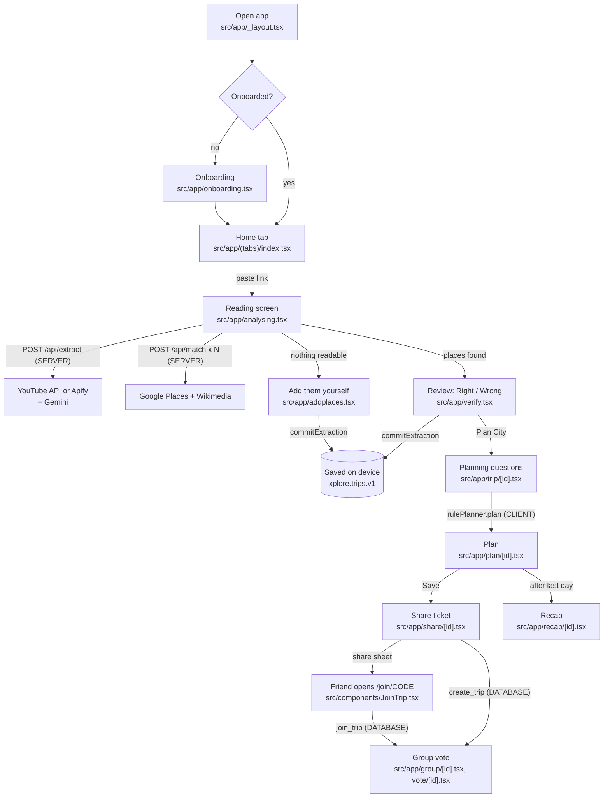

# Data flow: the user journey, video processing, and the planner

Traced from the code at `939a6bb`. Covers Part 2 (journey), Part 3 (video processing) and Part 10
(planner). Labels: **CLIENT** (phone or browser), **SERVER** (our API routes), **DATABASE**
(Supabase), **THIRD-PARTY**, **AI MODEL**.

---

## Part 2: the complete user journey

### The flow at a glance



### Step by step

Every step below: which screen, which function, which call, where it runs, what goes in and out,
where it's stored, what happens on failure, and which screen gets the result.

#### 1. User opens the app

- **Screen:** root layout `src/app/_layout.tsx` wraps everything in `TripsProvider`.
- **Function:** `TripsProvider` (in `src/state/trips.tsx`) reads the saved copy *before the first
  render*: `loadTrips()` reads `xplore.trips.v1`; `read(NAME_KEY)` and `read(PHOTO_KEY)` read the name
  and photo.
- **API call:** none on open. Two background jobs start once per launch:
  - Places whose coordinates are older than 30 days → `refreshPlace()` → `POST /api/match`, up to 10
    places.
  - Places still showing a video picture → `betterPhoto()` → `POST /api/match` (and maybe
    `/api/frames`), up to 30 places.
- **Where:** CLIENT (device storage). The background jobs go to the SERVER.
- **Stored:** in memory (React state) and the `live` registry (`src/data/registry.ts`).
- **On failure:** an unreadable saved copy is moved to `xplore.trips.unread` (`keepAside`) and the app
  starts fresh. Refresh failures are ignored; places stay as they were.
- **Next screen:** onboarding if `state.onboarded` is false, otherwise the Home tab.

#### 2. Home

- **Screen:** `src/app/(tabs)/index.tsx`, with `LinkBox` / `PasteButton` components.
- **Function:** on submit it runs `dispatch({ type: 'setPendingLink', url })`, then
  `track('link pasted', …)`, then `router.push('/analysing')` (around line 398).
- **API call:** none yet. PostHog gets the event: CLIENT → THIRD-PARTY.
- **Data:** the link is held in `state.pendingLink`, in memory only.

#### 3. Video processing and place extraction

- **Screen:** `src/app/analysing.tsx`, hook `useReading(url)`.
- **Function:**
  - Sample links (`isSampleLink`) play canned data from `src/data/api.ts` (`extractPlaces`, a 2.8 s
    fake wait).
  - Real links call `readLink(url, onFound)` in `src/lib/extract.ts`.
- **API calls:** `POST /api/extract` (SERVER), then `POST /api/match` once per place (SERVER), 5 at a
  time. Full detail is in Part 3 below.
- **Data sent:** `{ url }`, then `{ name, area, region, confidence }` per place.
- **Data back:** the video (title, channel, thumbnail, frames), `region`, `terrain` and the places
  (name, type, area, why, timestamp, confidence, visitMinutes, bestTime, price). Then per place:
  Google place ID, coordinates, address, types, photo.
- **Stored:**
  - SERVER side: `api_extractions` and `api_matches` (DATABASE).
  - Phone side: the finished result in device storage under `xplore.link.v2.yt:<id>` or `…ig:<code>`
    for 30 days, and the places in the in-memory registry.
  - Nothing is *saved to your trips* yet: `dispatch({ type: 'stageExtraction' })` only holds it.
- **On failure:** `ReadFailed` shows the reason.
  - `ApiFailure` with `retryable` → "Try again".
  - `assist` (Instagram unreadable, not configured, over the daily cap) → "Add them yourself".
  - `empty` with a known city → best-known spots.
- **Leaving early:** leaving with "Keep browsing" or a swipe back lets the read finish. It then lands
  on Home as places to check (`readInBackground`).
- **Next screen:** `/verify` (`router.replace('/verify')`), or `/addplaces`.

#### 4. Place verification (the user confirms)

- **Screen:** `src/app/verify.tsx`. Swipe cards (Right / Wrong), or a ticked list from 6 places
  (`CHECK_AS_LIST_FROM`).
- **Function:** when checking is done, a `useEffect` runs once:
  - `dispatch({ type: 'commitExtraction', extraction, placeIds: saved })`
  - `sendVerdicts(reel, …)`
- **Fixing a wrong card:** "Wrong → fix" and "Missed one?" open `PlaceSearchSheet`, which calls
  `searchPlaces()` → `POST /api/search`, then `placeFromPick()` → `POST /api/match` with the chosen
  place ID.
- **API calls:** `POST /api/feedback`, once per place (SERVER → DATABASE `api_feedback`). Best
  effort: failures are ignored (`.catch(() => {})`).
- **Note:** the server returns a `needsCheck` flag per match ("Google's top hit may be a namesake").
  **No app code reads it today.**
- **Next screen:** "Plan <city>" → `/trip/[id]`, or "Done for now" → back to Home.

#### 5. Places saved

- **Where:** reducer case `commitExtraction` in `src/state/trips.tsx`.
- **What happens:**
  - The confirmed places go into `state.collections[cityId]` (`placeIds`, `reelIds`, `addedAt`).
  - A place already saved in another city's collection stays there (`savedElsewhere`): one place,
    one collection.
  - Home decides "Near home" or "Cities" with `isNearHome()`: most places within 45 km of the home
    district.
- **Stored:** an effect in `TripsProvider` calls `saveTrips(state)`, which writes the *whole* saved
  copy to `xplore.trips.v1` on every change. CLIENT only; **nothing goes to the database**. The
  `saved_collections` table in `supabase/api.sql` exists but is not used.

#### 6. Trip planning questions

- **Screen:** `src/app/trip/[id].tsx`.
- **Questions, in order:**
  - Who's going (`solo | partner | friends | family`)
  - When (this weekend, next weekend, pick dates, not sure)
  - How many days
  - Pace (`relaxed | balanced | packed`)
  - Getting around (`local | drive | bus`)
  - Where you're staying
- **Functions:** while answering, `daysNeeded()` and `placesThatFit()` from `src/data/planner.ts` run
  on the phone to show hints ("fits 8 of your 11").
- **API calls:** only for where you're staying:
  - "Staying in town" → `findStay()` → `POST /api/search`, then `POST /api/match`.
  - Picking a hotel → `stayFromPick()` → `POST /api/match`.
- **On failure:** `findStay` returns null, and days start at the first place instead of the stay.

#### 7. Itinerary generation

- **Screen:** the `Build` step inside `src/app/trip/[id].tsx`.
- **Function:** `rulePlanner.plan({ cityId, saved, suggestions: getLocalPicks(id), prefs, pins, removed: [], seed: 1 })`.
  `rulePlanner.plan` simply calls `planNow()`.
- **Where:** CLIENT only. **No server, no AI, no API call.**
- **Data out:** a `TripPlan` (days → stops with clock times and travel legs, `left` places with
  reasons).
- **Stored:** `dispatch({ type: 'setTripPlan', plan })` → `state.tripPlans[cityId]` → device storage.
- **Next screen:** `/plan/[id]`.
- **On the plan screen** (`src/app/plan/[id].tsx`):
  - **Reshuffle:** tries new seeds (`plan.seed + k`) until some stop moves (`changedStops`); if none
    does, it says "Same plan…".
  - **Edits:** `removeStop`, `moveToDay`, `reorder`, `swapStop`, `addStop`, `addCustomStop`,
    `togglePin`, each followed by `retime`.
  - **Add a day:** plans again with `days + 1` to show what it would gain.

#### 8. Trip saved

- **Screen:** `src/app/plan/[id].tsx`, `saved()`.
- **Function:** `dispatch({ type: 'saveTrip', cityId })` sets `state.savedTrips[cityId] = true`, then
  `track('trip planned')` runs, then `router.replace('/share/[id]')`.
- **Stored:** device storage only.

#### 9. Sharing and group

- **Screen:** `src/app/share/[id].tsx`, `share()`.
- **Solo or offline setups** (Supabase keys absent): the plan card is shared as an image plus text
  via the share sheet (`sharePlanCard` in `src/lib/share.ts`). A **scripted demo vote** starts
  (`startGroup`).
- **Live trips** (Supabase configured):
  1. `createTrip()` in `src/lib/live/api.ts` calls the database function `create_trip` (DATABASE),
     which makes the `trips` row with a 6-letter code and adds you to `members`.
  2. `dispatch({ type: 'setRemote' })` remembers the trip ID and code on the device.
  3. The message includes `https://xplore.expo.app/join/<CODE>`.
- **Friend joins:** `src/app/join/[code].tsx` → `JoinTrip` component.
  1. `joinTrip(code, name)` calls the database function `join_trip`.
  2. `loadTrip()` reads the `trips`, `members` and `votes` rows.
  3. The plan is rebuilt with `planFromRow` → `fromWire` (`src/lib/live/wire.ts`), then goes to
     `/group/[id]`.
- **Live updates:** `watchTrip()` subscribes to realtime changes on the trip, its members and its
  votes. `LiveTrip` in `src/state/live.tsx` turns them into store actions.
- **Voting:** `src/app/vote/[id].tsx` → `useLiveVote().cast()`. The vote shows at once, then
  `castVote()` upserts a `votes` row.
- **Plan edits:** `usePlanWriter()` → `savePlan()` updates `trips.plan` (and `locked`).
- **Lock:** only the owner can lock; the database trigger `guard_lock` checks it.
- **On failure:**
  - Creating: "Couldn't reach Xplore's server…".
  - Votes and plan saves use `.catch(() => {})`: the change shows on this phone but may silently not
    reach others.

#### 10. Trip completion / recap

- **Trigger:** `useTripToRecap()` in `src/state/trips.tsx` finds a saved trip whose last day's date
  is before today and hasn't been recapped. Home shows a `RecapCard`
  (`src/components/home/RecapCard.tsx`).
- **Screen:** `src/app/recap/[id].tsx`. The person ticks the places they went to.
- **Function:** `dispatch({ type: 'finishRecap', cityId, been })` → `spotStatus[placeId] = 'been'`,
  `recapped[cityId] = true`. Then `track('trip recapped')`.
- **Stored:** device storage only. **No database record of trip completion.**

---

## Part 3: video processing, in detail

### YouTube link

| # | Question | Answer (with the code) |
|---|---|---|
| 1 | Where the URL enters | `LinkBox` / `PasteButton` on Home → `setPendingLink` → `src/app/analysing.tsx` |
| 2 | Which function receives it | `readLink(url)` in `src/lib/extract.ts`. It runs `parseLink()` from `src/server/links.ts` on the phone first; a bad link fails there with `unsupported_link`, with no network call. |
| 3 | Straight to our backend? | First it checks the **phone's** 30-day cache (`cache.read('yt:<id>')`). If that misses, it calls `POST /api/extract` on our server. The phone never calls YouTube or Gemini directly. |
| 4 | Which service reads the metadata | **SERVER → YouTube Data API v3** `videos.list?part=snippet,contentDetails` in `getVideo()` (`src/server/youtube.ts`). The code comment says 1 quota unit. |
| 5 | What's extracted | Title, description, tags, channel, publish date, duration, best thumbnail. Plus 3 frame URLs `i.ytimg.com/vi/<id>/maxres{1,2,3}.jpg` (or `hq…`), from `videoFrames()` in `pipeline.ts`. |
| 6 | How Gemini is called | `findPlaces({kind:'youtube', video}, key, model, fallback)` → `generate()` in `src/server/gemini.ts`: an HTTPS POST to `generativelanguage.googleapis.com/v1beta/models/<model>:generateContent`. It runs **in parallel** with `videoFrames`. |
| 7 | Which model | `gemini-3.5-flash-lite` (env `GEMINI_MODEL`), backup `gemini-3.8-flash` (env `GEMINI_FALLBACK_MODEL`), in `src/server/env.ts` |
| 8 | What prompt | System instruction = `YOUTUBE_INTRO` + `RULES` (`src/server/gemini.ts`, lines 10–38). The user part = `sourceText()`: `Title`, `Channel`, `Tags`, `Description` (the first 6,000 characters). Full text in [AI_ARCHITECTURE.md](AI_ARCHITECTURE.md). |
| 9 | Response format | JSON forced by `responseMimeType: 'application/json'` and `responseSchema: SCHEMA`: `{ region, terrain, places: [{ name, type, area, why, timestamp, confidence, visitMinutes, bestTime, price }] }`. Temperature 0.2. |
| 10 | Validation | `safeParse()` (bad JSON → null → zero places). `cleanPlaces()` keeps only well-formed entries: name 1–120 characters, unique by lower-case name, type in the list or else `sight`, `why` ≤140 characters, timestamp must look like `m:ss`, confidence clamped to 0–1, visitMinutes kept only if 10–600, bestTime and price kept only if valid, **at most 100 places** (a ceiling: every place named is kept). `region` and `terrain` are checked too. |
| 11 | How places are extracted | Only from what Gemini lists. The rules say "only places named in the text", skip generic mentions, and skip cities, stations and airports. |
| 12 | How Google Places is called | The phone sends `POST /api/match` once per place, **5 at a time** (`eachAtOnce`, `MATCH_AT_ONCE = 5`). The server's `match()` builds the query `"<name>, <area>, <region>"`, then: `beginMatch()` (one database round trip: rate limits, the stored match, daily caps) → if not stored, **Text Search** (`searchPlaceId`, `pageSize: 1`, IDs only) → **Place Details** (`getDetails`: id, location, types, formattedAddress, photos) → photo (Wikimedia first via `wikimediaPhoto`, else a Google photo if today's cap allows) → `putMatch()` saves it. |
| 13 | How the right place is matched | **Google's single top hit** for the text query is taken. There is no comparison of several candidates. `doubtful()` then marks `needsCheck = true` if Gemini's confidence is under 0.6, or if the address mentions neither the area nor the first two parts of the region. |
| 14 | Several possible matches | Not considered: `pageSize: 1`. Namesakes ("Om Beach") are what `needsCheck` is for, but **the app does not use `needsCheck`**. The person catches them on the review screen (Wrong → fix with search). |
| 15 | No place found | Google returns no ID: `putMatch(key, {placeId: null})` stores the miss for 7 days, and the answer is `{status:'unmatched'}`. On the phone that place is dropped. If *all* places fail: when every failure was an error, the error screen shows; otherwise `{kind:'empty'}`. |
| 16 | Video names no places | Gemini returns `places: []`. The phone gets `{kind:'empty', region}`. If a region is known, the failure screen offers **best-known spots**: `/addplaces` → `bestKnownSpots(region)` → `POST /api/sights` (Gemini `bestKnown`) + matches. Otherwise the person adds places by search. |
| 17 | Where results are stored | **DATABASE:** `api_extractions` (key = video ID, 30 days) and `api_matches` (key = lower-case query or `id:<placeId>`; place ID forever, coordinates 30 days). **Phone:** `xplore.link.v2.yt:<id>` for 30 days; after saving, the trips copy `xplore.trips.v1`. |

### Instagram link: what's different

1. `parseLink()` accepts `/reel/`, `/reels/`, `/p/`, `/tv/` and `/<user>/reel/`, and normalises to
   `https://www.instagram.com/reel/<code>/`. The cache key is `ig:<code>`.
2. `extractReel()` in `src/server/pipeline.ts`. If `APIFY_TOKEN` is missing, it returns
   `{status:'assist', reason:'not_configured'}` at once.
3. It checks rate limits (`allowExtract`) and the server cache (`getExtraction('ig:<code>')`). A cached
   result with zero places returns `assist: no_places` (with the region, if known).
4. It checks the daily reel cap (`allowReel('reel')`, 20 a day). Over the cap → `assist: daily_limit`.
5. **Apify** (THIRD-PARTY): `getReel()` in `src/server/instagram.ts` starts the actor
   `apify~instagram-reel-scraper` with `{ username: [url], resultsLimit: 1, includeTranscript: false }`,
   waits up to 45 s (checked every 20 s), with a cost cap of `maxTotalChargeUsd` $0.01. It reads:
   caption, hashtags, mentions, tagged accounts, location tag, latest comments, owner, duration,
   thumbnail, and for a photo post (a `/p/` link that isn't a video) its pictures. Failure →
   `assist: unreadable`. A run it stops waiting for is aborted.
   - **Photo posts:** the pictures (up to 20, Instagram's image servers only, 2 MB each at most) are
     fetched by `getSlides()` and sent to Gemini with the text, so a plan written on the slides is
     read. No extra Apify cost; about 1,100 input tokens a slide. A post stored before this
     (no duration, no `signals.slides`) is read again once.
6. If the reel has any text or pictures, Gemini is called with the `INSTAGRAM_INTRO + RULES + INSTAGRAM_RULES`
   prompt and `sourceText()` (poster, location tag, caption up to 4,000 characters, hashtags, tagged
   and mentioned accounts, transcript up to 6,000, comments up to 300 characters each).
7. **No places and the reel is ≤120 s long:** if the daily transcript cap allows (**1 a day**), Apify
   runs again with `includeTranscript: true` (100 s limit, cap $0.12), then Gemini runs again on the
   transcript.
8. The result is saved to `api_extractions` if it has places, or if the "no places" answer is final.
   A miss caused by today's cap is *not* saved, so it can try again tomorrow.
9. Matching with Google then works exactly as for YouTube.

---

## Part 10: the planner (`src/data/planner.ts`)

### In simple English

The planner is a recipe that runs on the phone:

1. **Decide the day's size.** Relaxed = at most 3 stops or 6 hours. Balanced = 4 stops or 8 hours.
   Packed = 6 stops or 10 hours. The hours include getting between places.
2. **Put nearby places together.** Every place starts as its own little group. Look at every pair of
   groups and ask "if these shared a day, how long would that day be?" Join the pair that makes the
   shortest day. Repeat until there's one group per trip day, or no join fits the size limits.
3. **Give groups their days.** The biggest groups get the first days.
4. **Leftovers.** A place without a day tries to squeeze into any day that still fits, cheapest first.
   If none fits, it's listed as "not in this plan", with a reason when there's a specific one.
5. **Dinner.** A day with room and no dinner gets one suggested local restaurant, only from the
   hand-made list for the sample cities.
6. **Order each day.** Morning places, then afternoon, then evening. Inside each part, always go to
   the nearest next place.
7. **Put clock times on it.** Start at 9, 8 or 7 am (by pace). Add the travel time to each place.
   Never start a place before its part of the day: afternoon places wait until 12:30, evening places
   until 4:30.

### Technically

| Piece | Code | What it does |
|---|---|---|
| Inputs | `PlannerInput` | `saved` places, `suggestions` (local picks), `prefs` (`TripPrefs`: party, when, start, days, pace, getting, terrain, stay), `pins` (placeId + day), `removed` IDs, `seed` |
| Output | `TripPlan` | `days[]` of `TripDay` (`date`, `stops[]`, `totalKm`, `home` leg), `left[]`, `leftWhy{}`, `removed[]`, `seed` |
| Day limits | `PACE_STOPS`, `PACE_HOURS`, `DAY_START` | `{relaxed:3, balanced:4, packed:6}` stops; `{6, 8, 10}` hours; starts at 9:00 / 8:00 / 7:00 |
| Part-of-day starts | `AFTERNOON = 12:30`, `EVENING = 16:30`; `partOf()` | Used both for waiting and for section headers |
| Travel time | `leg()` → `travelLegFor()` in `src/lib/geo.ts` | `distanceKm` (haversine, a straight line) × detour (flat 1.3, hilly 1.5, mountain 1.9) |
| | → `local` getting around | ≤2.5 km: walk at 4.8 km/h. ≤15 km on flat land: auto at 22 km/h + 4 min. Otherwise: cab at 35/28/28 km/h + 5 min. |
| | → `drive` | ≤0.8 km: walk. Otherwise car at 30 km/h (40 km/h over 40 km on flat land) + 5 min. |
| | → `bus` | ≤1.2 km: walk. Otherwise bus at 18/16/15 km/h + a 12/15/20 min wait. |
| Day length | `dayMinutes(places, trip)` | Orders the places with `routeOrder`, then adds visit minutes + legs between + out-and-back to the stay (if known) |
| Grouping | `joinIntoDays(groups, days, fits, length, rand)` | Greedy merging (agglomerative clustering). While there are more groups than days, try every pair (never two pinned groups), keep the pair whose joined `length` + `rand()*5` noise is smallest and that `fits`. Stop when no pair fits. |
| Fits | `fitsDay` inside `planNow` | `places.length <= PACE_STOPS[pace] && dayMinutes <= PACE_HOURS[pace]*60` |
| Days needed (hint) | `daysNeeded()` | The same merge down to 1 group; returns how many groups remain |
| Assigning days | in `planNow` | Pinned groups keep their day. Free groups are sorted by size (then shortness) into empty days; with `seed ≠ 1` the free days are shuffled |
| Leftovers | in `planNow` | Each place of a group that didn't get a day tries every day where `fitsDay` still holds, picking the one with the least extra minutes; otherwise it goes to `left` |
| Leftover reasons (`leftWhy`) | in `planNow` | "Takes longer than a whole day at this pace." / "About N h each way from <stay>…" (fits Packed, or "worth a night nearby") / "About N h from your other places, so it needs a day of its own." (nearest other place > 45 min, `NEARBY_MINUTES`) / none |
| Dinner | in `planNow` | Per day: if no stop is `food` + `evening`, add the first `suggestions` place that still fits, marked `suggested: true`, never used twice. `suggestions` is `getLocalPicks(cityId)`, which is **empty for cities from real links**. |
| Ordering | `routeOrder(stops, trip, flip)` | Split by `bestTime` (morning, afternoon, evening). Each part is a nearest-neighbour chain. The day's first stop is the nearest to the stay, or (with no stay) whichever start gives the shortest morning. `flip` reverses the first part (a 50% chance on reshuffle when there's no stay). |
| Timing | `timeDay(stops, prefs, date)` | cursor = `DAY_START`; for each stop: + leg minutes; start = max(cursor, part start) rounded to 5 min; cursor = start + visit minutes. Adds the `home` leg back to the stay. |
| Reshuffle | `plan/[id].tsx` → `rulePlanner.plan({…, seed: plan.seed + k})` | A seeded random generator (`random(seed)`, mulberry32-style) changes tie-breaks, day shuffling and flip. Up to `REGENERATE_TRIES` (6) seeds until `changedStops` finds a difference. |
| Edits | `removeStop`, `moveToDay`, `reorder`, `swapStop`, `addStop`, `addCustomStop`, `togglePin`, `retime` | Each returns a new plan and retimes every day. Removed places are remembered in `removed`, so a reshuffle doesn't bring them back. |
| Pace calculation | n/a | Pace is **chosen by the person**, not calculated. The hint `placesThatFit()` runs the whole planner for each pace to say "fits K of N". |
| "Why" lines | `src/data/why.ts` | Reads the finished plan (distances, areas, times) and writes sentences. Rules, not AI. |
| Old day builder | `src/data/plan.ts` (`buildPlan`, `findGap`) | An older, simpler one-day builder (sorted by part of day, no grouping). `planner.ts` doesn't use it. It is still used by the city page for its preview: `buildPlan(previewed)` in `src/app/city/[id].tsx`. `src/components/plan/PlanSections.tsx` imports its `DayPlan` type. |

### Worked example (real output)

Five Kochi places, run through `planNow()` exactly as the app would (typical coordinates, getting
around by walking and autos, flat land, no stay given, seed 1):

| Place | Kind | Best time | Visit |
|---|---|---|---|
| St. Francis Church | sight | morning | 45 min |
| Mattancherry Palace | sight | morning | 60 min |
| Kashi Art Cafe | food | afternoon | 60 min |
| Fort Kochi Beach | sight | evening | 60 min |
| Marine Drive | sight | evening | 60 min |

**1 day, Balanced (at most 4 stops, 8 h):**

```
8:00  St. Francis Church
8:55  Mattancherry Palace   (+11 min, 2.7 km by auto)
12:30 Kashi Art Cafe        (+11 min, 2.7 km by auto)   ← waited ~2.5 h for "afternoon"
16:30 Marine Drive          (+19 min, 5.3 km by auto)   ← waited ~2.5 h for "evening"
Not in this plan: Fort Kochi Beach (days full)
```

How it got there:
- **Travel legs.** Church → Palace: straight line ≈2.1 km × 1.3 = 2.7 km. Over 2.5 km on flat land,
  so it's an auto: 2.7 / 22 × 60 + 4 ≈ 11 min.
- **Grouping.** Only 4 stops fit, so the greedy joining ended with one place out. It happened to leave
  out the beach 150 m from the church, and kept Marine Drive, 5 km away. The merge picks the
  cheapest *pair* at each step, not the best set of four.
- **Timing.** The 12:30 and 16:30 part starts create the two long waits. Nothing moves a stop earlier.

**2 days, Balanced:** all 5 fit.

```
Day 1  8:00 St. Francis Church → 12:30 Kashi Art Cafe (walk, 3 min) → 16:30 Marine Drive (auto, 19 min)
Day 2  8:00 Mattancherry Palace → 16:30 Fort Kochi Beach (auto, 12 min)
```

**1 day, Relaxed (at most 3 stops):** Church → Cafe → Marine Drive; Palace and Beach are left out.

No dinner was added in any run: for a city from a real link the local picks list is empty.
