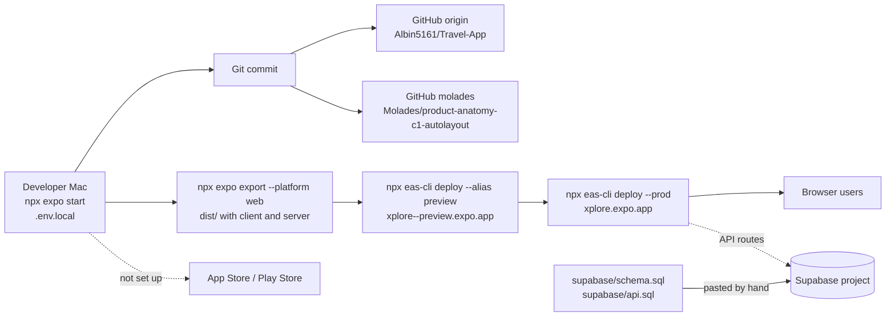

# Infrastructure and deployment

Part 14 (deployment) and Part 15 (the accounts the app needs), traced from the repo at `939a6bb`.
Where a step happens outside the repo (in someone's terminal or a dashboard), it's marked
**outside the repo**.

## In plain words

Today Xplore reaches real people as a **website**, `xplore.expo.app`. The website and its small
server are built on the developer's Mac and uploaded to Expo's hosting with one command: first to a
preview address, then to the real one. The database is Supabase, set up once by pasting two SQL files
into its dashboard. **There is no App Store or Play Store build set up yet**, and nothing is automated:
no pipeline runs when code is pushed.

## From code to a real user

| Stage | What exists | Evidence |
|---|---|---|
| Developer machine | `npx expo start` runs the app **and** the API routes locally (Metro + Expo dev server). Keys in `.env.local` (git-ignored). Testing on a phone: Expo Go by QR code. | `README.md` "Getting started"; `package.json` scripts; `.gitignore` (`.env*.local`); `.env.example` |
| Git | Two remotes: `origin` → `github.com/Albin5161/Travel-App`, `molades` → `github.com/Molades/product-anatomy-c1-autolayout` | `git remote -v` |
| Build | `npx expo export --platform web`. Metro bundles the web app and, because `web.output` is `server`, the API routes too, into `dist/` (git-ignored). React Compiler on. | `app.json`, `metro.config.js`, `.gitignore` |
| Backend deployment | `eas deploy` (EAS Hosting) uploads `dist/`: first with `--alias preview` (→ `xplore--preview.expo.app`), then `--prod` (→ `xplore.expo.app`). The API routes deploy **with** the website; there's no separate backend deploy. | **Outside the repo** (commands run in a terminal). Hints in code: `PLAN_LINK_BASE = 'https://xplore.expo.app'` (`src/lib/share.ts`), "EAS Hosting dashboard" (`src/server/log.ts`), `app.json` `owner: albin5161`, `extra.eas.projectId` |
| Database | Supabase project. Schema applied by pasting `supabase/schema.sql`, then `supabase/api.sql`, into the SQL Editor; "Anonymous sign-ins" switched on in the dashboard. No migration tool. | `README.md` "Getting started" (Supabase steps); SQL file headers |
| Server secrets in production | EAS environment variables (production environment). A deploy log showed EAS supplying `APIFY_TOKEN`, `GEMINI_API_KEY`, `PLACES_API_KEY`, `SUPABASE_SECRET_KEY`, `YOUTUBE_API_KEY` and the Supabase public keys. | **Outside the repo** (EAS dashboard). Server reads them via `src/server/env.ts`. |
| Mobile build | **Not configured.** No `eas.json`; `app.json` has no `ios.bundleIdentifier` or `android.package`. | Absence of files |
| TestFlight / Play Store | **Not configured.** | Same |
| Production user | Opens `xplore.expo.app` in a browser | `src/lib/share.ts`, share card text |

## Environments

| Environment | Where | Config | Notes |
|---|---|---|---|
| Development | The developer's Mac, `localhost:8081` | `.env.local` | Without `SUPABASE_SECRET_KEY` the API runs **open** and limits live in memory (and reset every request on the dev server). `src/server/auth.ts`, `src/server/limits.ts`. The Google map key is restricted to `localhost:8081` (per `.env.example` guidance; the actual restriction is set in Google Cloud, outside the repo). |
| Preview (acts as staging) | `xplore--preview.expo.app` | Same EAS production environment variables | Created with `eas deploy --alias preview` (outside the repo). The same database as production: there is **no separate staging database** in the repo. |
| Production | `xplore.expo.app` | EAS production environment variables | `NODE_ENV=production` makes the server refuse to run without Supabase (`env.production()`) |

## Environment variables

| Name | Public? | Used by | Purpose |
|---|---|---|---|
| `GOOGLE_API_KEY` | Server only | `env.youtubeKey()`, `env.placesKey()` | Fallback key for YouTube + Places |
| `YOUTUBE_API_KEY` | Server only | `getVideo()` | YouTube Data API |
| `PLACES_API_KEY` | Server only | `src/server/places.ts` | Places API (New) |
| `GEMINI_API_KEY` | Server only | `generate()` | Gemini |
| `GEMINI_MODEL`, `GEMINI_FALLBACK_MODEL` | Server only | `src/server/env.ts` | Override the models |
| `PLACES_PHOTOS` | Server only | `env.placesPhotos()` | `off` skips Google photos |
| `APIFY_TOKEN` | Server only | `getReel()` | Instagram (optional) |
| `INSTAGRAM_TRANSCRIPTS` | Server only | `env.instagramTranscripts()` | `off` skips transcripts |
| `SUPABASE_URL` / `EXPO_PUBLIC_SUPABASE_URL` | URL is public | server + app | Supabase project |
| `SUPABASE_SECRET_KEY` | **Secret** | `src/server/supabase.ts` | Server's full-access key |
| `EXPO_PUBLIC_SUPABASE_PUBLISHABLE_KEY` | Public by design | `src/lib/live/client.ts` | App's limited key (row rules apply) |
| `EXPO_PUBLIC_API_URL`, `EXPO_PUBLIC_API_FALLBACK_URL` | Public | `src/lib/api.ts` | Where the app finds the API. Not set in the repo; the web uses the same site. |
| `EXPO_PUBLIC_GOOGLE_MAPS_WEB_KEY`, `EXPO_PUBLIC_GOOGLE_MAP_ID` | Public by design | `GoogleMap.web.tsx` | Web map |
| `EXPO_PUBLIC_POSTHOG_KEY`, `EXPO_PUBLIC_POSTHOG_HOST` | Public by design | `src/lib/analytics.ts` | Analytics |
| `LIMIT_*` (17 of them) | Server only | `src/server/limits.ts` | Rate limits and daily caps |
| `NODE_ENV` | n/a | `env.production()` | Production mode |

Rule of thumb from the code: **anything starting `EXPO_PUBLIC_` is copied into the app or website
that users download**. Everything else stays on the server.

## Build process, signing, and platform requirements

| Topic | Today |
|---|---|
| Web build | `expo export --platform web` → `dist/` with static pages (static rendering), JS bundles, and server functions for `/api/*` |
| Checks before a deploy | Documented in `AGENTS.md` / `README.md`: `npx tsc --noEmit`, `npx expo lint`, `npx expo-doctor`. Run by hand. A key check script (that secret keys aren't in `dist/`) has been run from a scratch folder **outside the repo**. |
| App signing | **Not set up.** No credentials in the repo (`.gitignore` excludes `*.p8`, `*.p12`, `*.jks`, `*.mobileprovision`, `*.key`, which is standard Expo ignore rules). EAS would manage signing when a build is made. |
| iOS requirements | For TestFlight / App Store: an Apple Developer account, a bundle identifier, and `eas.json` build profiles. None in the repo. Background location (`isIosBackgroundLocationEnabled: true` in `app.json`) will need App Store review justification (the permission texts are in `app.json`). The phone map isn't built (placeholder). |
| Android requirements | For Play: a Google Play Developer account, a package name, and build profiles. None in the repo. `isAndroidBackgroundLocationEnabled: true`. |
| Native API address | A phone release build would need `EXPO_PUBLIC_API_URL` pointing at `https://xplore.expo.app` (the web uses relative paths). Not set in the repo. |
| Features needing a development build | Background geofencing, lock-screen notifications and a native Google map (`README.md`, "What needs a development build") |

---

## Part 15: the accounts and services the app needs

Only services the code actually uses or the repo configures are listed. **No prices here**: every
cost needs checking against the provider's current pricing.

| Service | Needed for | Status today |
|---|---|---|
| Apple Developer Program | TestFlight / App Store | Not set up (no iOS build config) |
| Google Play Console (developer account) | Play Store | Not set up |
| Expo / EAS account (`owner: albin5161`) | EAS Hosting (web + API); later EAS Build / Submit | In use (hosting) |
| Supabase | Database, anonymous auth, realtime | In use |
| Google Cloud project | YouTube Data API v3, Places API (New), Maps JavaScript API, and the Gemini key (from AI Studio) | In use |
| Apify | Reading Instagram reels | In use (optional) |
| PostHog | Analytics | In use if the key is set (a deploy log shows it is) |
| Wikimedia (Wikipedia, Wikivoyage, Commons) | Free photos and city facts | In use; no account needed |
| GitHub | Code hosting (2 repos) | In use |
| Domain | `xplore.expo.app` is an Expo subdomain | No custom domain in the repo |
| Email | Only a contact address in the Wikimedia `User-Agent` header | No email service (no sign-up emails; sign-in is anonymous) |
| Monitoring / error tracking | EAS Hosting logs; PostHog `app crashed` events | No dedicated service (Sentry etc.) |
| File storage / CDN | n/a | None (images are remote links or bundled) |

### Cost categories (to be priced later)

| One-time | Monthly fixed | Variable (per use) |
|---|---|---|
| Google Play developer registration | Apple Developer Program (billed yearly) | Gemini tokens (if beyond the free tier) |
| Custom domain purchase, if wanted | EAS plan (if beyond the free tier) | Google Places: Text Search, Details, Photos, Autocomplete (beyond free allowances) |
| | Supabase plan (if beyond the free tier) | YouTube Data API (quota, not money, by default) |
| | PostHog plan (if beyond the free tier) | Maps JavaScript API map loads (beyond free allowances) |
| | Apify plan (the code assumes the free plan's monthly credit) | Apify per reel and per transcript minute |
| | | EAS Hosting requests / bandwidth (if metered) |
| | | Supabase database size, egress, realtime connections |

Details and formulas: [COST_MODEL.md](COST_MODEL.md).
