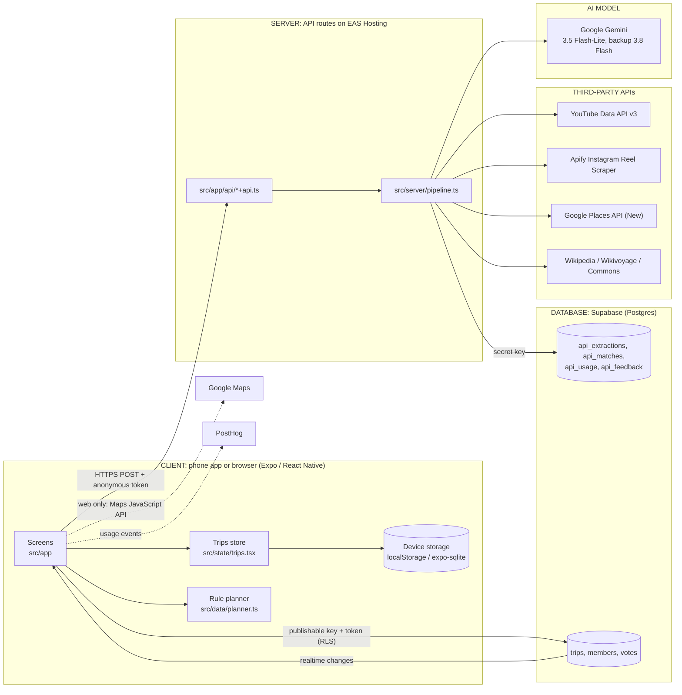

# Xplore: technical architecture

What exists today, traced from the code at commit `939a6bb` (30 Sep 2026). Nothing here is a
recommendation. Where the repository can't confirm something, it says **UNKNOWN**.

`README.md` has the short version: setup, structure, checks and deploy commands.

## The documents

| File | What it answers |
|---|---|
| [TECHNICAL_ARCHITECTURE.md](TECHNICAL_ARCHITECTURE.md) | This page: the one-page summary, the tech stack, how the app talks to the server, and the key lists |
| [DATA_FLOW.md](DATA_FLOW.md) | The whole user journey step by step, what happens to a pasted video, and how the planner works |
| [DATABASE.md](DATABASE.md) | Every table, what creates, reads, updates and deletes it, and what lives on the phone |
| [API_REFERENCE.md](API_REFERENCE.md) | Every server route, and every Google and other outside API |
| [AI_ARCHITECTURE.md](AI_ARCHITECTURE.md) | Every Gemini call: model, prompt, schema, retries, and why AI is used there |
| [INFRASTRUCTURE.md](INFRASTRUCTURE.md) | How code gets to users, environments, and the accounts the app needs |
| [COST_MODEL.md](COST_MODEL.md) | Everything that can cost money, and a formula per user action |
| [SCALING.md](SCALING.md) | What happens at 100 to 100,000 users, and 14 failure scenarios |
| [SECURITY.md](SECURITY.md) | Sign-in, keys, database rules, and the risks visible today |
| [TECHNICAL_GLOSSARY.md](TECHNICAL_GLOSSARY.md) | The technical words used here, in plain English |
| [INTERVIEW_GUIDE.md](INTERVIEW_GUIDE.md) | How Albin can explain Xplore technically |

---

## 1. One-page summary

**In plain words.** Xplore is one codebase that makes an iPhone app, an Android app and a website.
Today real people use the **website** at `xplore.expo.app`. When someone pastes a YouTube or Instagram
link, the app sends it to Xplore's own small server. The server reads the video's text (YouTube's
official API, or Apify for Instagram) and asks **Google Gemini** to list the places mentioned. The
app then asks the server to find each place on **Google Places**, which gives its exact location and
often a photo. The person checks the places (Right / Wrong) and saves them. Planning the trip is done
by **plain rules on the phone**, not by AI. Everything the person saves stays on their phone or
browser. Only shared group trips and the server's caches and counters go to the database,
**Supabase**. Everyone is signed in automatically and anonymously: there are no accounts.



**Who does what:**

| Layer | Responsibility | Where |
|---|---|---|
| CLIENT | Every screen, the trips store, saving to the device, the **trip planner**, the "why" lines, share images, PDF, arrival alerts | `src/app`, `src/state`, `src/data`, `src/lib`, `src/components` |
| SERVER | Checks who's calling, rate limits, reads videos, calls Gemini and Google, caches results | `src/app/api/*+api.ts` → `src/server/*` |
| DATABASE | Shared caches (video results, place matches, city notes), usage counters, review answers, group trips and votes | `supabase/schema.sql`, `supabase/api.sql` |
| THIRD-PARTY APIs | Video text (YouTube, Apify), places (Google Places), free photos and city facts (Wikimedia), web map (Google Maps JS), analytics (PostHog) | see [API_REFERENCE.md](API_REFERENCE.md) |
| AI MODEL | Reading text into a list of places, a city's best-known spots, and city notes | `src/server/gemini.ts`, `src/server/citynotes.ts` |

---

## 2. Technology stack (Part 1)

"Runs on" says where the code actually executes.

| Area | What it is | Why the app uses it | Where in the code | Runs on |
|---|---|---|---|---|
| **Frontend framework** | React 19.2.3, the library that builds screens from components | One way to write every screen | Every `.tsx` file; `package.json` | Phone / browser |
| **Programming language** | TypeScript ~6.0.3: JavaScript with types, checked before running | Catches mistakes early; one language for app and server | `tsconfig.json`; all of `src/` | Compiled away before running |
| **Mobile framework** | Expo SDK 57 (`expo ~57.0.24`) on React Native 0.86.3, plus `react-native-web` 0.21 for the website | One codebase for iOS, Android and web | `package.json`, `app.json` | Phone / browser |
| **Backend framework** | Expo Router **API routes**: files ending in `+api.ts` become server endpoints. No separate server framework (no Express, no Next.js). | The server lives in the same project and deploys with the website | `src/app/api/*+api.ts`, logic in `src/server/`; `app.json` → `"web": { "output": "server" }` | Server |
| **Database** | Supabase: hosted Postgres with sign-in, row rules and realtime | Free tier, anonymous sign-in, live group trips | `supabase/schema.sql`, `supabase/api.sql`; clients in `src/lib/live/client.ts` (app) and `src/server/supabase.ts` (server) | Third-party (Supabase cloud) |
| **Authentication** | Supabase **anonymous sign-in**: every install gets a random user ID, with no email or password | Lets the server tell callers apart and rate-limit them, and lets group trips have members, without accounts | `ensureUser()` in `src/lib/live/client.ts`; token check in `identify()` in `src/server/auth.ts` | Phone + Supabase + server |
| **File / image storage** | **None as a service.** No Supabase Storage or S3. Images are bundled files (`assets/`), links to Google, Wikimedia, YouTube (`i.ytimg.com`) or Instagram images, or the profile photo as a data URI in device storage | Nothing uploaded means nothing to host | `src/lib/extract.ts` (`framePhoto`, `toPlaces`), `src/server/commons.ts`, `src/state/trips.tsx` (`PHOTO_KEY`) | Third-party image hosts; device |
| **Hosting** | EAS Hosting (Expo's hosting) at `xplore.expo.app` | Deploys the website and API together with one command | No config file beyond `app.json` (`owner`, `extra.eas.projectId`). Mentioned in `src/server/log.ts` and `src/server/auth.ts`; the link base is in `src/lib/share.ts` (`PLAN_LINK_BASE`) | Third-party |
| **Server runtime** | In production, EAS Hosting's serverless runtime. `auth.ts` reads Cloudflare's `cf-connecting-ip` header "on EAS Hosting". In development, Node.js via the Expo dev server. | Comes with Expo | `src/server/auth.ts` (`clientIp`), `src/server/supabase.ts` (Node 20/22 notes) | Server. Exact limits (memory, time per request) are **UNKNOWN** from the repo. |
| **Package manager** | npm | Installs libraries | `package-lock.json` (no `bun.lock` or `yarn.lock`) | Developer machine |
| **Build system** | Metro bundler through `expo export`; React Compiler on | Turns the source into app / web bundles | `metro.config.js` (adds WOFF2 fonts), `app.json` → `experiments.reactCompiler` | Developer machine |
| **State management** | React `useReducer` + Context: one store for trips, plus a module-level registry for places from real links. No Redux or Zustand. | Simple, and every screen reads the same data | `TripsProvider` and `reducer` in `src/state/trips.tsx`; `live` and `register()` in `src/data/registry.ts`; group state in `src/state/group.tsx`, `src/state/live.tsx` | Phone / browser |
| **Navigation** | Expo Router ~57: file-based routes, a Stack plus tabs | Every file in `src/app` is a screen; deep links like `/join/ABC123` work | `src/app/_layout.tsx` (Stack), `src/app/(tabs)/_layout.tsx` | Phone / browser |
| **Styling / UI** | React Native `StyleSheet` with the app's own tokens; blur, glass and gradients; Reanimated 4 for motion; SVG for maps and illustrations; Geist and Plus Jakarta Sans fonts | The "sky and glass" design | `src/theme/tokens.ts`, `src/theme/sky.ts`, `src/components/sky/*`, `DESIGN.md` | Phone / browser |
| **Maps** | Web: Google Maps JavaScript API via `@vis.gl/react-google-maps`. Sample cities: a hand-drawn SVG map. Phone apps: a placeholder ("coming to the app soon"). | Real places need a real map | `src/components/GoogleMap.web.tsx`, `src/components/GoogleMap.tsx`, `src/components/CityMap.tsx` | Browser + Google |
| **Analytics** | PostHog (`posthog-react-native`), 16 named events, counts only | Measure the funnel: paste → found → saved → planned → shared → joined | `src/lib/analytics.ts` (`track`, `AnalyticsEvent`) | Phone → PostHog cloud |
| **Logging** | One `console` line per API request (route, status, time, steps, 8-character anonymous user ID, video ID) | Trace a failed paste afterwards | `src/server/log.ts` (`writeLog`), called by `respond()` in `src/server/errors.ts` | Server → EAS Hosting logs |
| **Error tracking** | No Sentry or similar. A root `ErrorBoundary` shows a recovery screen and sends an `app crashed` event (error name only) to PostHog. | Know that crashes happen, without collecting data | `ErrorBoundary` in `src/app/_layout.tsx` | Phone → PostHog |
| **CI/CD** | **None in the repo.** No `.github/` workflows, no `eas.json`. Builds and deploys are run by hand. | n/a | n/a | Developer machine |
| **Environment config** | `.env.local` (git-ignored) holds keys; `.env.example` documents them. Names starting `EXPO_PUBLIC_` are built into the app and are public; all others are server-only. | Keep secrets off the phone | `.env.example`, `src/server/env.ts`, `src/lib/api.ts`, `src/lib/live/client.ts` | Developer machine + EAS env vars |
| **Other device features** | Location + background geofencing (arrival alerts), local notifications, haptics, sounds, clipboard, share sheet, image capture (phones), jsPDF (the plan's PDF, on the website and the phones) | Product features | `src/lib/arrival.ts`, `src/lib/haptics.ts`, `src/lib/sound.ts`, `src/lib/share.ts`, `src/lib/planPdf.ts`, `src/lib/planPdfSave.ts` (`.native.ts` on phones), `src/lib/cardImage.ts` | Phone / browser |

---

## 3. How the app talks to the server (Part 9)

**In plain words.** The app sends the server a small message (a "request") over the internet and
waits for an answer (a "response"). Both are JSON text. Every request carries a pass (the anonymous
sign-in token) so the server knows which install is asking.

```
Phone / browser
  │  POST /api/extract   {"url": "..."}   Authorization: Bearer <Supabase access token>
  ▼
Server route  src/app/api/extract+api.ts
  │  respond() → caller() checks the token → pipeline.extract()
  │     ├─ Supabase: rate limits (api_consume), cache read (api_extractions)
  │     ├─ YouTube Data API / Apify
  │     ├─ Gemini (generateContent)
  │     └─ Supabase: cache write
  ▼
JSON answer  {"status":"done","places":[...],"region":"...","timings":{...}}
  │
Phone: then POST /api/match once per place, 5 at a time
  │     └─ server: Supabase (api_match_begin) → Google Places → Wikimedia → Supabase (api_matches)
  ▼
Phone: turns the answers into places, keeps them in memory, shows the review screen
```

| Question | What the code does |
|---|---|
| **Style** | REST-like JSON over HTTPS. Every app route is `POST` with a JSON body; only `/api/health` is `GET`. No GraphQL. |
| **One helper for all calls** | `post<T>(path, body, timeoutMs)` in `src/lib/api.ts` |
| **Server address** | `EXPO_PUBLIC_API_URL`, else a relative path (the same website). The web build uses the relative path. For phone release builds, `EXPO_PUBLIC_API_URL` is **not set anywhere in the repo** (UNKNOWN whether it is set outside it). An optional `EXPO_PUBLIC_API_FALLBACK_URL` is tried second. |
| **Request** | Headers `Content-Type: application/json` + `Authorization: Bearer <token>`. Bodies over 16 KB are refused (`readJson` in `src/server/errors.ts`). |
| **Response, success** | The route's JSON, often with `timings` (ms per step) and `cached` |
| **Response, failure** | `{"error": {"code": "...", "message": "..."}}` with an HTTP status. Codes: `bad_request`, `unsupported_link`, `video_unavailable`, `missing_key`, `upstream`, `quota`, `unauthorized`, `rate_limited`, `too_large`, `not_configured`. Messages are written to be shown to people as is. |
| **Auth header** | Added by `authHeader()` in `src/lib/api.ts`: signs in anonymously first if needed (`ensureUser`) |
| **Timeouts (app side)** | Extract 100 s (`EXTRACT_MS`), match 15 s (`MATCH_MS`), sights 30 s, search 8 s, place info 10 s, city notes 20 s, frames and feedback 8 s |
| **Retries (app side)** | No automatic retry to the same server. It tries the fallback server once for "our side" errors (`upstream`, `not_configured`, `missing_key`, 5xx), never for `quota` or request errors. Retrying is otherwise a person tapping "Try again" (only shown when `retryable`). |
| **Retries (server side)** | Gemini: the main model twice (1.2 s apart), then the backup model (`generate()` in `src/server/gemini.ts`). Nothing else retries. |
| **Loading states** | The reading screen (`src/app/analysing.tsx`, `useReading`) shows mascots and place names as they arrive (the `onFound` callback). "Keep browsing" lets the read finish in the background (`readInBackground`). |
| **Error states** | `ReadFailed` in `src/app/analysing.tsx`: a sentence per failure; "Try again" only when retryable; "Add them yourself" for unreadable reels; best-known spots when the city is known |
| **Caching** | Phone: each link's result for 30 days (`xplore.link.v2.*` in device storage, `cache` in `src/lib/extract.ts`); Google place info only while the app is open (`placeInfos` in `src/lib/details.ts`). Server: video results 30 days, place matches (ID forever, coordinates 30 days), city notes and best-known spots 30 days, all in Supabase (`src/server/store.ts`). |
| **Group trips** | Not through the server. The app talks to Supabase directly (`src/lib/live/api.ts`): database functions (`create_trip`, `join_trip`), table reads and writes, and a realtime channel per trip (`watchTrip`). |

---

## 4. The key lists

### External APIs and services

| # | Service | Used for | Called from |
|---|---|---|---|
| 1 | Google Gemini API (`generativelanguage.googleapis.com`) | Places from video text; best-known spots; city notes | Server |
| 2 | YouTube Data API v3 (`videos.list`) | A video's title, description, tags, length | Server |
| 3 | YouTube image host (`i.ytimg.com`) | Video frames as fallback photos | Server checks, app shows |
| 4 | Apify: Instagram Reel Scraper actor | A reel's caption, tags, comments, optional transcript | Server |
| 5 | Google Places API (New): Text Search | A name → a place ID | Server |
| 6 | Google Places API (New): Place Details | Location, address, types, photo references; the place page's rating, hours and reviews | Server |
| 7 | Google Places API (New): Place Photos | A photo URL | Server |
| 8 | Google Places API (New): Autocomplete | "Missed one?" search, and where you're staying | Server |
| 9 | Google Maps JavaScript API | The web map for real cities | Browser |
| 10 | Wikipedia + Wikimedia Commons APIs | Free place photos | Server |
| 11 | Wikipedia + Wikivoyage APIs | City notes (then condensed by Gemini) | Server |
| 12 | Supabase (Postgres, Auth, Realtime) | Sign-in, caches, counters, feedback, group trips | Server and app |
| 13 | PostHog | Usage events | App |
| 14 | EAS Hosting | Serves the website and the API | Infrastructure |
| 15 | GitHub (2 remotes: `origin` Albin5161/Travel-App, `molades` Molades/product-anatomy-c1-autolayout) | Code storage | Developer |

### Database entities

Server-only (the secret key): `api_extractions`, `api_matches`, `api_feedback`, `api_usage`.
App-accessible (row rules): `trips`, `members`, `votes`, `saved_collections` (**defined but not used
by any code**), plus Supabase's own `auth.users`. On the device: one saved copy of all trips
(`xplore.trips.v1`), name, photo, link cache. Details: [DATABASE.md](DATABASE.md).

### Backend endpoints

`POST /api/extract`, `POST /api/match`, `POST /api/sights`, `POST /api/search`, `POST /api/place`,
`POST /api/city`, `POST /api/frames`, `POST /api/feedback`, `GET /api/health`.
Details: [API_REFERENCE.md](API_REFERENCE.md).

### AI calls

1. `findPlaces()`: YouTube text → places (once per new video)
2. `findPlaces()`: Instagram text → places (once per new reel; a second time if a transcript is fetched)
3. `bestKnown()`: city name → up to 10 best-known spots (once per city per 30 days)
4. `readCityNotes()` → `generate()`: Wikipedia + Wikivoyage text → city notes (once per city per 30 days)

All four go through `generate()` in `src/server/gemini.ts`. **No AI call plans the trip.**
Details: [AI_ARCHITECTURE.md](AI_ARCHITECTURE.md).

---

## 5. Ten things to understand

1. **One codebase, three outputs.** Expo makes the iPhone app, the Android app and the website. Today
   only the **website** is deployed to users. No store builds are configured (no `eas.json`, no
   bundle IDs in `app.json`).
2. **The server is just files in `src/app/api/`.** Each `+api.ts` file is an endpoint. They're thin;
   the real work is in `src/server/pipeline.ts`.
3. **AI reads, rules plan.** Gemini turns video text into a list of places. The itinerary comes from
   `planNow()` in `src/data/planner.ts`, which runs on the phone, instantly and for free.
4. **Gemini never sees the video.** It sees text only: YouTube's title, description and tags, or a
   reel's caption, location tag, tagged accounts, comments and sometimes a transcript.
5. **Google Places is the source of truth for "where".** Gemini names a place; the server searches
   Google for it and keeps Google's place ID and coordinates.
6. **No accounts, but everyone is signed in.** Anonymous Supabase sign-in gives each install an ID.
   The server uses it for rate limits; group trips use it for membership.
7. **Your trips live on your device.** Saved places and plans are one JSON copy in device storage
   (`xplore.trips.v1`). Only *shared* group trips go to the database. Clearing the browser or
   reinstalling loses them.
8. **Caches are shared by everyone.** A video read once is kept 30 days for every user; a place name
   matched once is reused. The second person to paste a video pays nothing.
9. **Hard daily caps keep spending at zero.** `src/server/limits.ts` caps Google lookups, photos,
   searches, Instagram reads and more per day, set under free allowances. Past a cap, users see
   "We've reached today's limit".
10. **Travel times are estimates, not routes.** `src/lib/geo.ts` multiplies straight-line distance by
    a detour factor and divides by a set speed. No routing API is called.

## 6. Ten biggest technical risks (details in [SECURITY.md](SECURITY.md) and [SCALING.md](SCALING.md))

1. **Hard daily caps are also a ceiling on users.** For example, 20 Instagram reels a day across
   everyone, 300 new place lookups, and 30 place pages with reviews.
2. **Trips exist on one device only.** No backup and no account; clearing storage or switching
   phones loses everything that isn't shared.
3. **Phone apps aren't release-ready.** There's no store build config, no native Google map, and no
   production API address for native builds in the repo.
4. **Last write wins on shared trips.** `savePlan()` overwrites the whole plan, so two people editing
   at once can undo each other.
5. **Any member can rewrite a shared plan.** Row rules allow any member to update the `plan` column
   wholesale.
6. **Rate limits per person can be sidestepped** by minting new anonymous sign-ins. Per-network and
   global caps are the backstop.
7. **Instagram depends on a scraper** (Apify) that "breaks now and then when Instagram changes"
   (comment in `src/server/instagram.ts`).
8. **Long requests on serverless.** An Instagram read with a transcript can run about 40–100 s. The
   host's request time limit is UNKNOWN from the repo.
9. **No automated tests or CI.** Only a manual script (`scripts/test-api.mjs`); nothing runs on push.
10. **Shared plans carry whole place records between phones.** `fromWire()` → `restore(wire.live)`
    (`src/lib/live/wire.ts`) loads the places, names and photo links another member wrote into the
    `plan` JSON, so a member can put arbitrary text and image links on everyone's screen.
